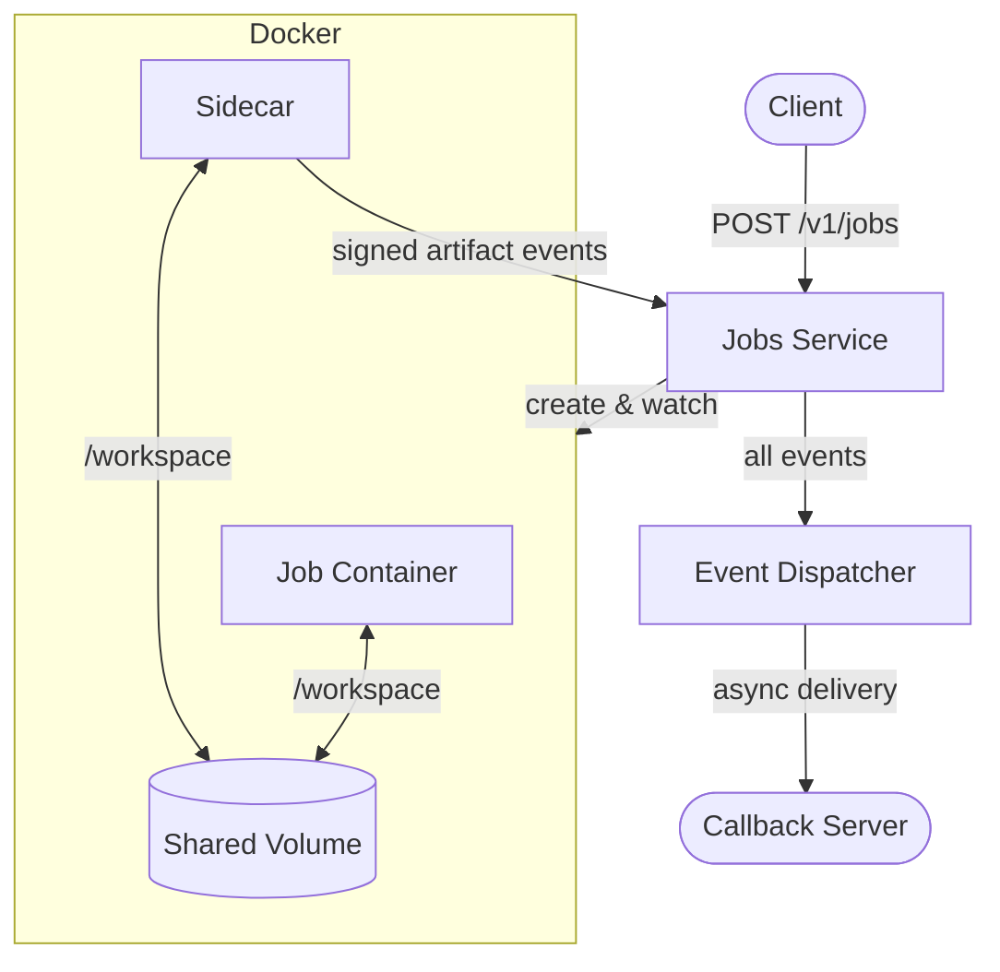
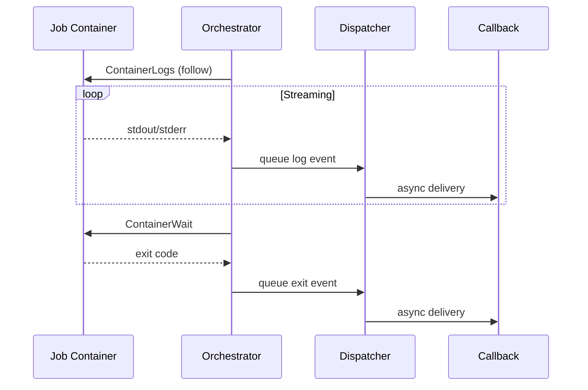
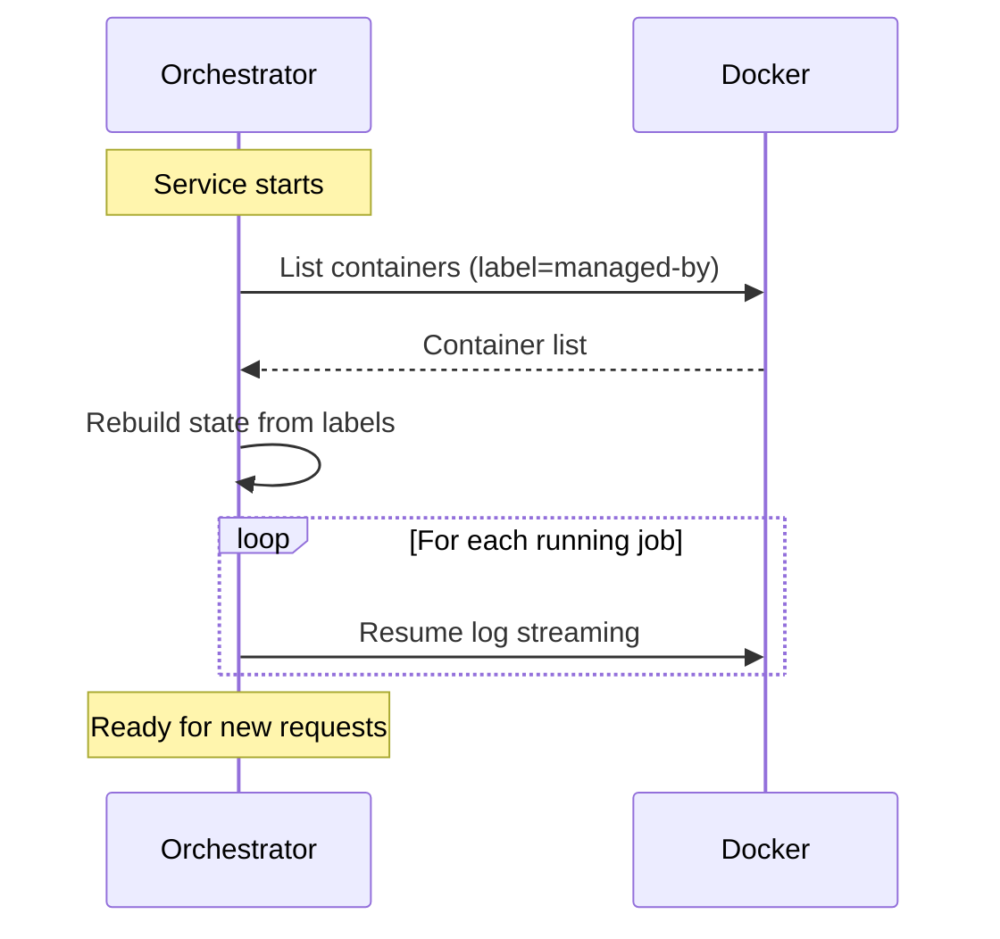

# Architecture

## Overview

Async job execution via Docker containers with webhook callbacks. Jobs share the default bridge network and use a dedicated volume for artifact processing between the job container and sidecar.



## Key Design Decisions

### Sidecar for Artifacts, Orchestrator for Lifecycle

The sidecar (`cmd/job-sidecar`) handles artifact processing (downloads, uploads, archives) while the orchestrator streams logs and detects exit via Docker API.

**Why?** If the service restarts mid-job, the orchestrator can reconnect to Docker and resume log streaming. The sidecar handles artifacts which complete before/after the job runs based on dependencies.



See: `internal/orchestrator/docker/docker.go` -> `reconcile()`, `watchUntilExit()`

### Async Event Dispatch with Circuit Breaker

Callback events are delivered asynchronously via a bounded worker pool. Each destination host has its own circuit breaker to prevent cascading failures.

**Why?** Synchronous callbacks would block job execution. The circuit breaker prevents slow/failing callback servers from exhausting resources.

Features:
- Bounded buffer (drops events when full, logs warning)
- Configurable worker pool for concurrent delivery
- Per-host circuit breaker (fails fast when destination is unhealthy)
- Exponential backoff retry (no retry on 4xx errors)
- Graceful shutdown with drain period

See: `internal/dispatcher/memory.go`, `pkg/circuitbreaker/`

### Callback Proxy for Sidecar Events

By default, sidecar callbacks (artifact events) are routed through the orchestrator.

```
Sidecar ──signs & POST /internal/events──► Orchestrator ──dispatcher──► Callback Server
```

**Why?** This ensures all callbacks go through the robust dispatcher with circuit breaker and retry logic.

**How it works:**
1. Orchestrator sets sidecar's `CALLBACK_URL` to `http://host.docker.internal:8080/internal/events?url=<actual>` and passes `CALLBACK_KEY` for signing
2. Sidecar builds CloudEvent, signs it with HMAC-SHA256, and POSTs to the proxy URL with `X-Signature-256` header
3. Orchestrator's `/internal/events` endpoint extracts destination from query params and signature from header
4. Event is dispatched via the robust dispatcher (signature is preserved)

See: `internal/api/handler.go` -> `ProxyEvent()`, `internal/orchestrator/docker/docker.go` -> `createSidecarContainer()`

### Reserve/Commit Pattern for Job Creation

Jobs are created in two phases: reserve the ID slot (with nil state), then commit after Docker resources are ready.

**Why?** Prevents race conditions where two concurrent requests for the same job ID both pass the existence check. The first to reserve wins; others get "already exists" error.

See: `internal/orchestrator/docker/state.go` -> `reserve()`, `commit()`, `release()`

### Restart Resilience

On startup, the orchestrator scans Docker for existing job containers and resumes watching them.



**Why?** Jobs survive service restarts. No external state store needed.

See: `internal/orchestrator/docker/docker.go` -> `reconcile()`

### TTL-Based Cleanup via Docker State

Completed jobs are retained for a configurable period, then cleaned up by a background maintenance goroutine. The cleanup uses Docker's `State.FinishedAt` timestamp rather than tracking completion time ourselves.

**Why?** Using Docker as the source of truth means cleanup works correctly even after service restarts - we don't need to persist completion times.

See: `internal/orchestrator/docker/docker.go` -> `runMaintenance()`, `cleanupExpiredJobs()`

### Streaming Uploads (No Memory Buffering)

File uploads stream directly from disk to HTTP, reopening the file for each retry attempt.

**Why?** Large files shouldn't be loaded into memory. The HTTP transport closes the request body after sending, so we reopen the file rather than seeking.

See: `internal/artifact/types/upload.go` -> `Apply()`, `doUpload()`

## Callback Events

CloudEvents 1.0 format with optional HMAC-SHA256 signing. Events are sent for: `start`, `log`, `exit`, `artifact`.

See: `pkg/cloudevent/`, `internal/job/event.go`

## Security Model

- **Volume isolation**: Each job gets its own Docker volume
- **Input validation**: Path traversal blocked, URLs must be http/https
- **Callback signing**: HMAC-SHA256 with shared secret

See: `internal/job/service.go` -> `validate()`, `validatePath()`, `validateURL()`

## Graceful Shutdown

On shutdown:
1. Stop accepting new requests
2. Wait for load balancer drain (configurable)
3. Drain dispatcher queue (deliver pending events)
4. Cancel all watch goroutines and wait for completion
5. Close Docker client

**Why the drain wait?** Load balancers need time to stop routing traffic after health checks fail. Skipped in dev mode (`SHUTDOWN_DRAIN_WAIT=0s`).

See: `cmd/jobs-service/main.go`, `internal/orchestrator/docker/docker.go` -> `Close()`
