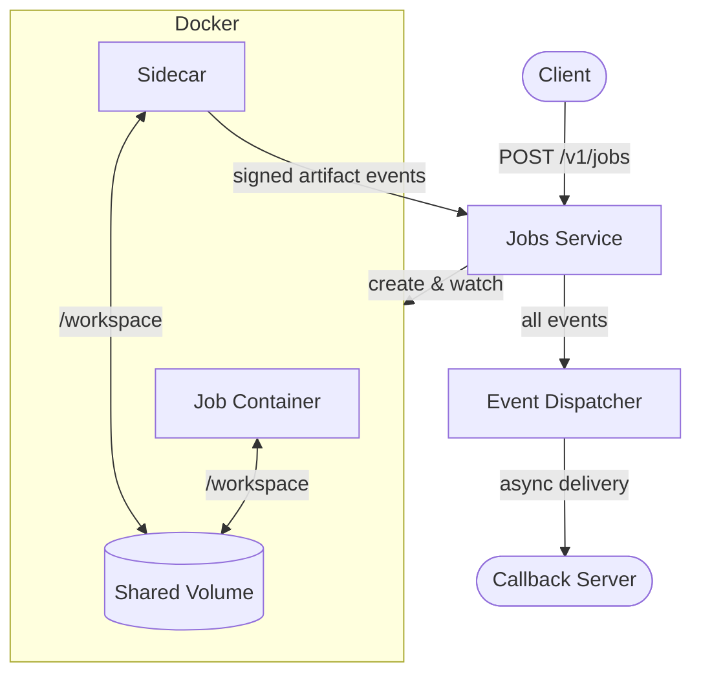
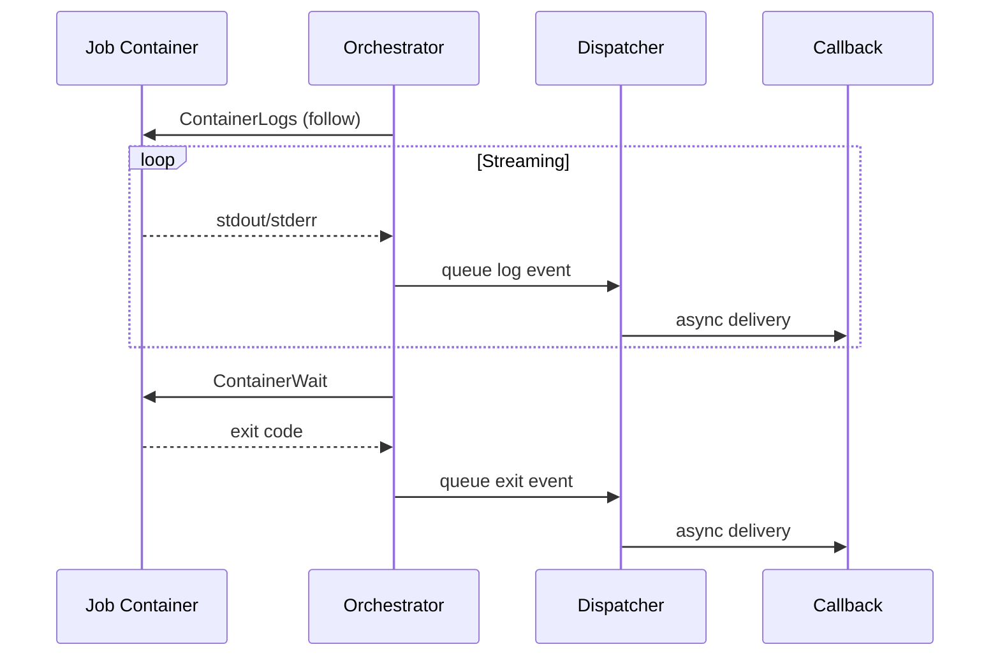
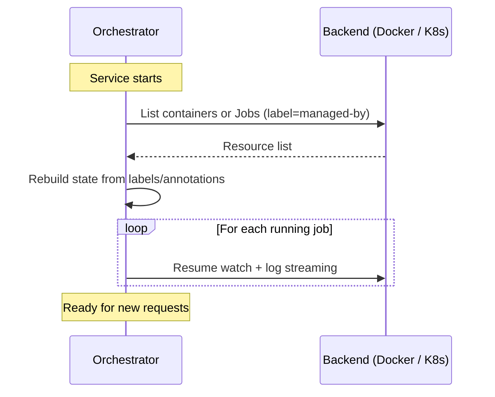

# Architecture

## Overview

Async job execution with webhook callbacks, pluggable across two backends:

- **Docker** — jobs run as two sibling containers (worker + sidecar) sharing a named volume.
- **Kubernetes** — jobs run as `batch/v1.Job` resources whose Pod contains the worker plus a native sidecar (K8s 1.29+), sharing an `emptyDir` workspace.

The backend is selected at startup via `ORCHESTRATOR_BACKEND=docker|kubernetes`. Everything above the backend — the HTTP API, job state machine, artifact processing, callback dispatcher — is backend-agnostic.

The diagram below shows the Docker topology; the K8s flow is structurally identical but replaces the two containers with one Pod containing an `artifact-pre` init, a `worker` main container, and an `artifact-post` native sidecar, all sharing an `emptyDir` volume.


```mermaid
flowchart TB
    Client([Client])
    Service[Jobs Service]
    Dispatcher[Event Dispatcher]
    Callback([Callback Server])

    subgraph Docker
        Worker[Job Container]
        Sidecar[Sidecar]
        Volume[(Shared Volume)]
    end

    Client -->|POST /v1/jobs| Service
    Service -->|create & watch| Docker
    Worker <-->|/workspace| Volume
    Sidecar <-->|/workspace| Volume
    Sidecar -->|signed artifact events| Service
    Service -->|all events| Dispatcher
    Dispatcher -->|async delivery| Callback
```

## Key Design Decisions

### Sidecar for Artifacts, Orchestrator for Lifecycle

The sidecar (`cmd/job-sidecar`) handles artifact processing (downloads, uploads, archives) while the orchestrator streams logs and detects exit via Docker API.

**Why?** If the service restarts mid-job, the orchestrator can reconnect to Docker and resume log streaming. The sidecar handles artifacts which complete before/after the job runs based on dependencies.


```mermaid
sequenceDiagram
    participant Job as Job Container
    participant Orch as Orchestrator
    participant Disp as Dispatcher
    participant Callback

    Orch->>Job: ContainerLogs (follow)
    loop Streaming
        Job-->>Orch: stdout/stderr
        Orch->>Disp: queue log event
        Disp->>Callback: async delivery
    end
    Orch->>Job: ContainerWait
    Job-->>Orch: exit code
    Orch->>Disp: queue exit event
    Disp->>Callback: async delivery
```

See: `internal/orchestrator/docker/docker.go` -> `reconcile()`, `watchUntilExit()`

### Async Event Dispatch with Circuit Breaker

Callback events are delivered asynchronously via a bounded worker pool. Each destination host has its own circuit breaker to prevent cascading failures.

**Why?** Synchronous callbacks would block job execution. The circuit breaker prevents slow/failing callback servers from exhausting resources.

Features:
- Bounded buffer (drops events when full, logs warning)
- Configurable worker pool for concurrent delivery
- Per-host circuit breaker (fails fast when destination is unhealthy)
- Exponential backoff retry (no retry on 4xx errors)
- Graceful shutdown with drain period

See: `internal/dispatcher/memory.go`, `pkg/circuitbreaker/`

### Artifact Reporting via Orchestrator

Sidecar artifact results are posted to the orchestrator, which dispatches them as CloudEvent callbacks.

```
Sidecar ──POST /internal/jobs/{jobId}/artifact──► Orchestrator ──dispatcher──► Callback Server
```

**Why?** This ensures all callbacks go through the robust dispatcher with circuit breaker and retry logic.

**How it works:**
1. Orchestrator sets the sidecar's `ARTIFACT_ENDPOINT` to `http://host.docker.internal:8080` and `CALLBACK_URL`/`CALLBACK_KEY` for the outbound callback destination
2. Sidecar posts an `ArtifactReport` to `POST /internal/jobs/{jobId}/artifact` after each artifact operation
3. Orchestrator builds a `orchestrator.job.artifact` CloudEvent from the report and queues it in the dispatcher

See: `internal/api/handler.go` -> `ReportArtifact()`, `internal/sidecar/runner.go` -> `NewHTTPSink()`, `internal/orchestrator/docker/docker.go` -> `createSidecarContainer()`

### Reserve/Commit Pattern for Job Creation

Jobs are created in two phases: reserve the ID slot (with nil state), then commit after Docker resources are ready.

**Why?** Prevents race conditions where two concurrent requests for the same job ID both pass the existence check. The first to reserve wins; others get "already exists" error.

See: `internal/job/controller.go` -> `Reserve()`, `Commit()`, `Release()`

### Kubernetes Backend

Each orchestrator job maps to a single `batch/v1.Job` (`parallelism=1`, `completions=1`, `backoffLimit=0`, `restartPolicy=Never`). The Pod contains:

- `artifact-pre` regular init container — processes pre-job artifacts and exits
- `artifact-post` **native sidecar** (init container with `restartPolicy: Always`, GA in K8s 1.29) — starts alongside the worker, blocks on SIGTERM
- `worker` main container — the user workload

An `emptyDir` volume backs the workspace at `req.Workspace` on all three containers. When the worker main container exits, kubelet sends SIGTERM to the post-sidecar (standard native-sidecar semantics), which unblocks it to run post-artifacts and exit. The sidecar never calls the K8s API — the pod's ServiceAccount needs zero RBAC.

The jobs-service ServiceAccount needs Role permissions on `batch/jobs` (CRUD), `pods` (watch), and `pods/log` (get). `ttlSecondsAfterFinished` handles K8s-side GC of finished Jobs, so most of the Docker-backend maintenance loop is redundant here and reduced to cleaning up the in-process `MemoryStore`.

Lifecycle watching: per-job `corev1.Pods.Watch` filtered by the `job.id=<id>` label. Worker container state transitions map directly to the same `job.Signal` types the Docker backend emits (`Started`, `Exited`, `Failed`, `LogLine`).

The sidecar binary supports three modes: `combined` (Docker flow — pre → ready marker → wait → post), `pre` (K8s init container), `post` (K8s native sidecar, blocks on SIGTERM then runs post-artifacts under a detached context).

See: `internal/orchestrator/kubernetes/`, `internal/sidecar/runner.go` → `Run/RunPre/RunPost`

### Restart Resilience

On startup, the orchestrator reconciles pre-existing jobs: the Docker backend lists containers with the `managed-by=jobs-service` label; the K8s backend lists `batch/v1.Jobs` with the same label. Both resume watching in-flight jobs.


```mermaid
sequenceDiagram
    participant Orch as Orchestrator
    participant Backend as Backend (Docker / K8s)

    Note over Orch: Service starts
    Orch->>Backend: List containers or Jobs (label=managed-by)
    Backend-->>Orch: Resource list
    Orch->>Orch: Rebuild state from labels/annotations
    loop For each running job
        Orch->>Backend: Resume watch + log streaming
    end
    Note over Orch: Ready for new requests
```

**Why?** Jobs survive service restarts. No external state store needed.

See: `internal/orchestrator/docker/docker.go` -> `reconcile()`, `internal/orchestrator/kubernetes/kubernetes.go` -> `reconcile()`

### TTL-Based Cleanup

Completed jobs are retained for a configurable period, then cleaned up by a background maintenance goroutine.

- **Docker backend**: uses Docker's `State.FinishedAt` timestamp rather than tracking completion time ourselves, so cleanup works correctly even after service restarts.
- **Kubernetes backend**: relies on `ttlSecondsAfterFinished` on the Job spec — kubelet GCs finished Jobs and their Pods. The maintenance loop only reaps orphan entries from the in-process store.

See: `internal/orchestrator/docker/docker.go` -> `runMaintenance()`, `cleanupExpiredJobs()`; `internal/orchestrator/kubernetes/kubernetes.go` -> `cleanupExpired()`

### Streaming Uploads (No Memory Buffering)

File uploads stream directly from disk to HTTP, reopening the file for each retry attempt.

**Why?** Large files shouldn't be loaded into memory. The HTTP transport closes the request body after sending, so we reopen the file rather than seeking.

See: `internal/artifact/upload.go` -> `Apply()`, `doUpload()`

## Callback Events

CloudEvents 1.0 format with optional HMAC-SHA256 signing. Events are sent for: `start`, `log`, `exit`, `artifact`.

See: `pkg/cloudevent/`, `internal/job/event.go`

## Security Model

- **Volume isolation**: Each job gets its own Docker volume
- **Input validation**: Path traversal blocked, URLs must be http/https
- **Callback signing**: HMAC-SHA256 with shared secret

See: `internal/job/service.go` -> `validate()`, `validatePath()`, `validateURL()`

## Graceful Shutdown

On shutdown:
1. Stop accepting new requests
2. Wait for load balancer drain (configurable)
3. Drain dispatcher queue (deliver pending events)
4. Cancel all watch goroutines and wait for completion
5. Close the backend client (Docker) / drop client-go caches (K8s)

**Why the drain wait?** Load balancers need time to stop routing traffic after health checks fail. Skipped in dev mode (`SHUTDOWN_DRAIN_WAIT=0s`).

See: `cmd/jobs-service/main.go`, `internal/orchestrator/docker/docker.go` -> `Close()`, `internal/orchestrator/kubernetes/kubernetes.go` -> `Close()`
